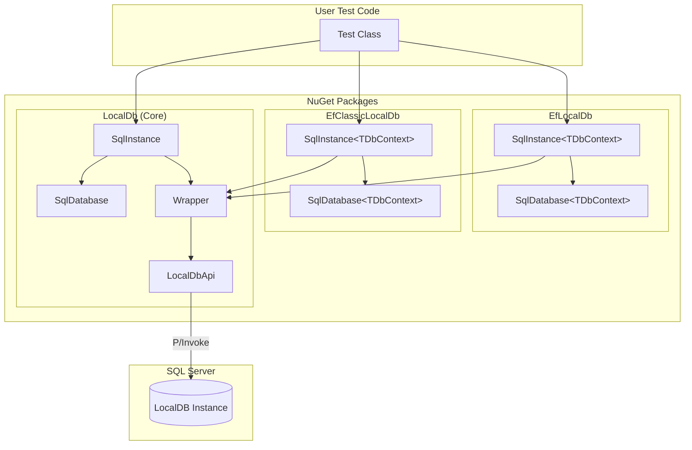
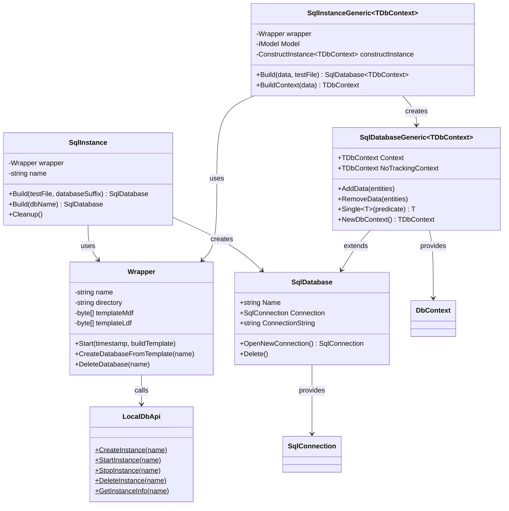
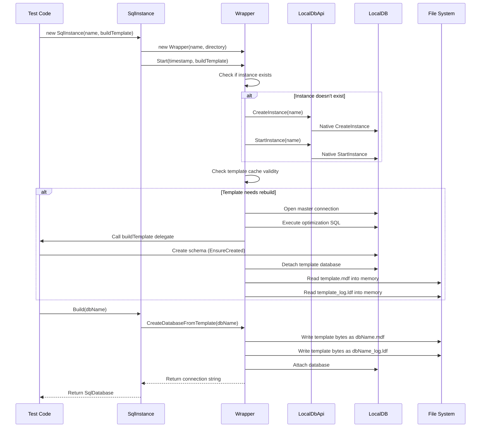
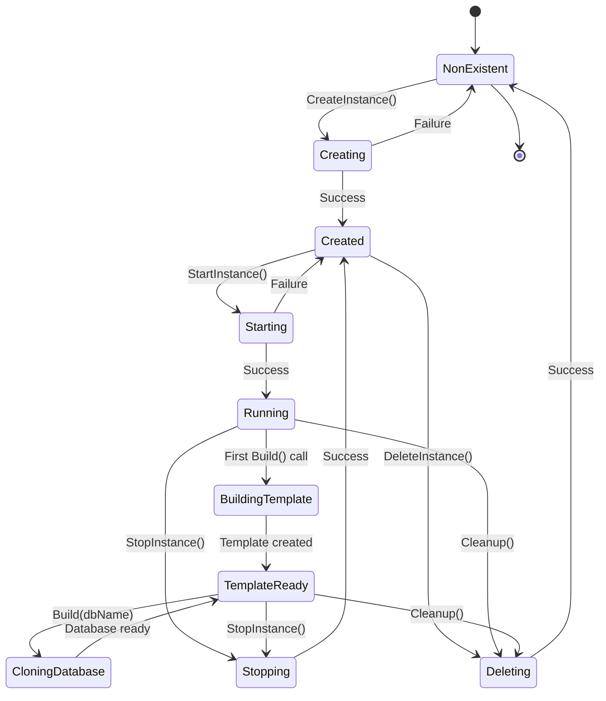
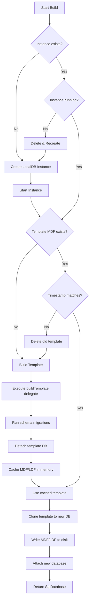
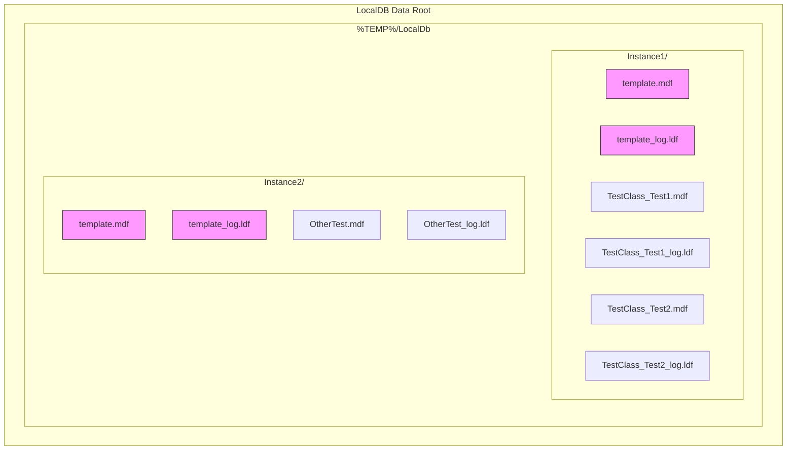
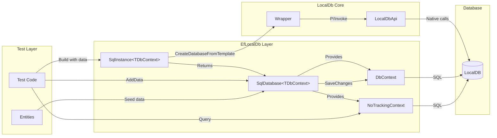
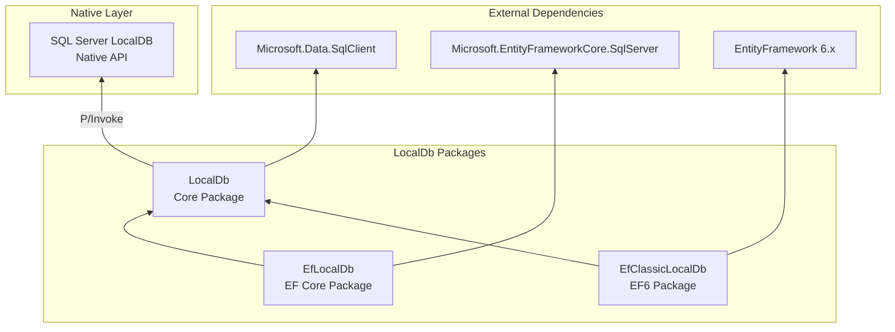

# LocalDb - Architecture Diagrams

This document contains Mermaid diagrams explaining how the LocalDb project works.

## 1. Architecture Overview

High-level view of the three NuGet packages and their relationships.

## 2. Class Relationships

Key classes and their dependencies.

## 3. Database Creation Sequence

Step-by-step flow of creating a test database.

## 4. Instance Lifecycle State Machine

All possible states of a LocalDB instance.

## 5. Template Caching Flow

Decision tree for cache invalidation and template management.

## 6. File System Organization

How databases are stored on disk.

## 7. EF Core Integration Data Flow

How data moves through the EF Core integration layer.

## 8. Package Dependencies

External and internal dependencies between packages.

