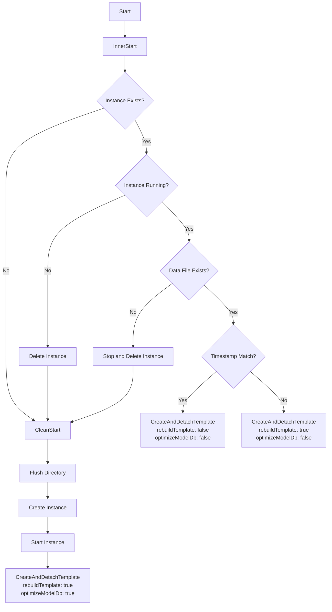
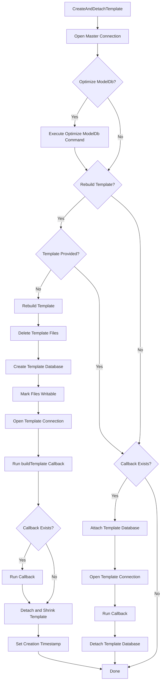
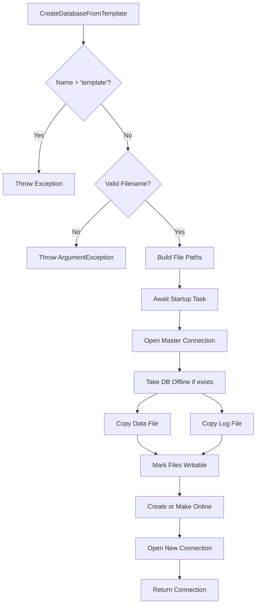
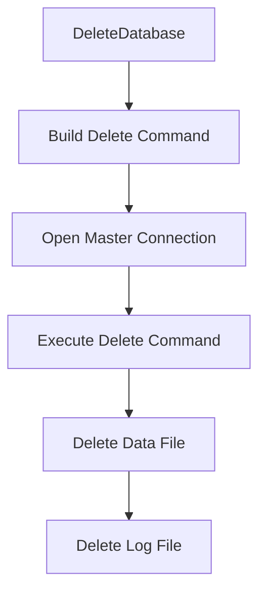
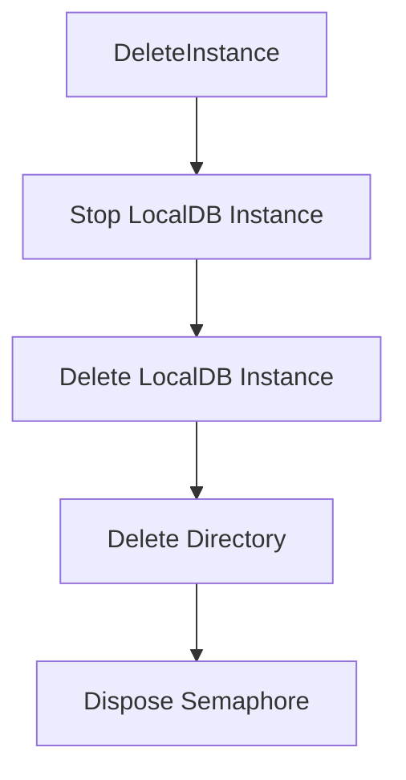
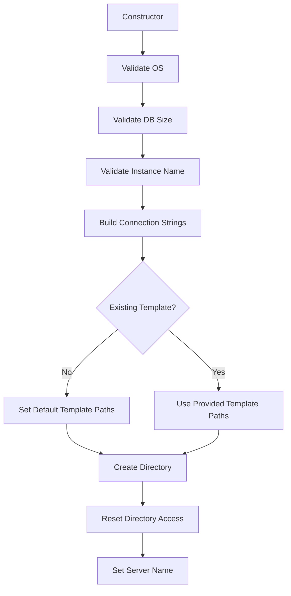

# LocalDB Wrapper Workflow

This document describes how `Wrapper.cs` manages LocalDB instances.

## Instance Startup Flow

## CreateAndDetachTemplate Flow

## Create Database From Template Flow

## Delete Database Flow

## Delete Instance Flow

## Constructor Initialization

