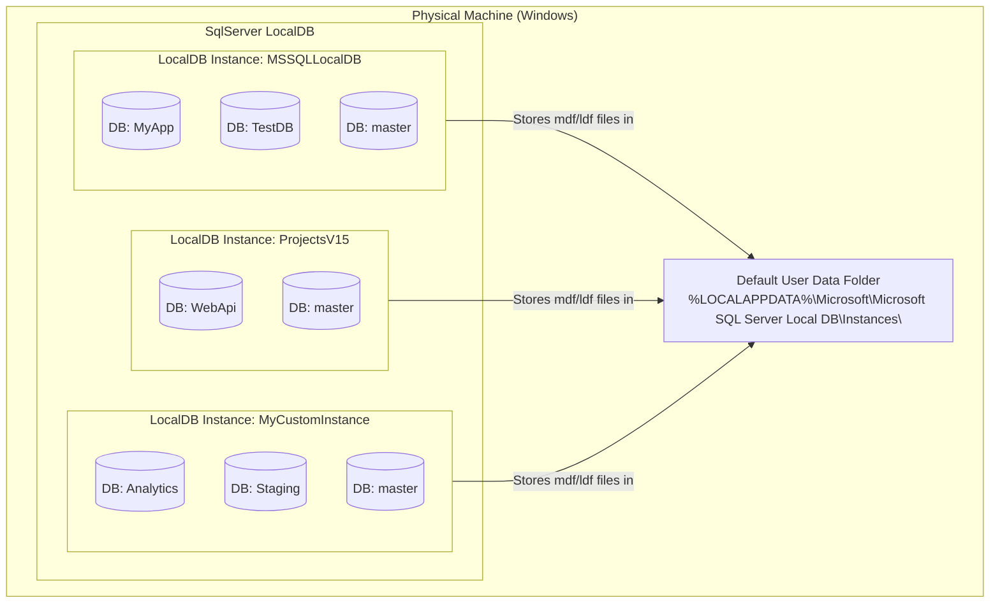
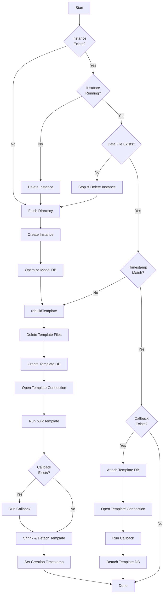
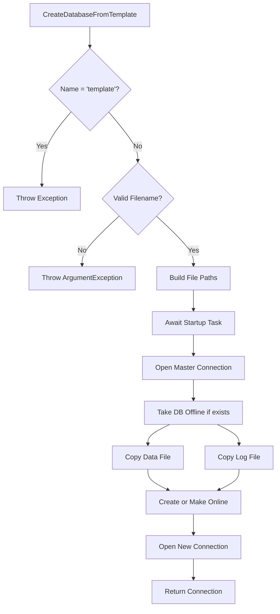
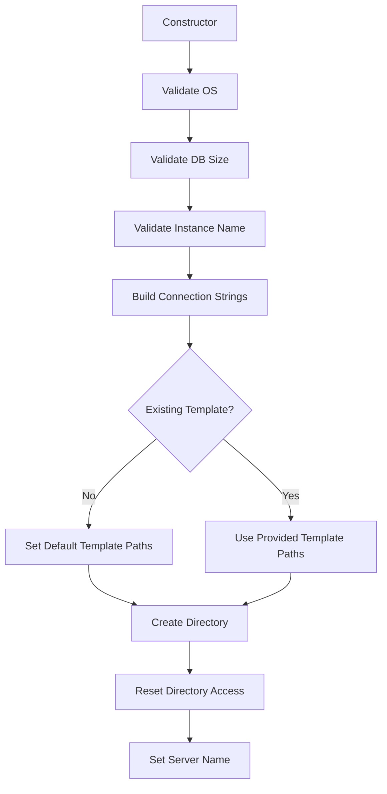

## LocalDB

How MS SqlServer LocalDB is structured



Key relationships:

 * Physical Machine → One Windows machine can have one LocalDB engine installed
 * LocalDB Engine → Can host multiple isolated instances (each is like a mini SQL Server)
 * Instance → Each contains multiple databases (always includes system DBs like master)
 * Storage → Each instance stores its .mdf and .ldf files in a subfolder under %LOCALAPPDATA%


## Instance Startup Flow



## CreateAndDetachTemplate Flow

```mermaid
flowchart TD
```

## Create DB From Template Flow



## Constructor Initialization


