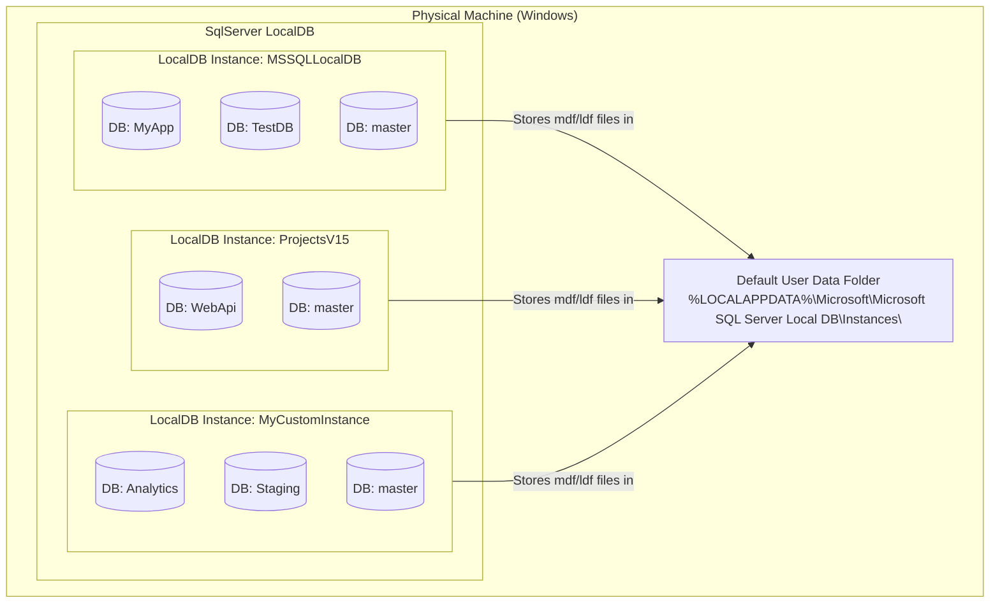
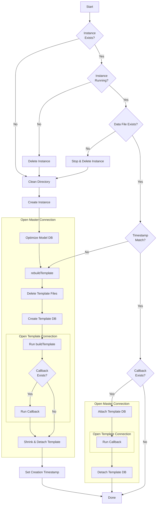
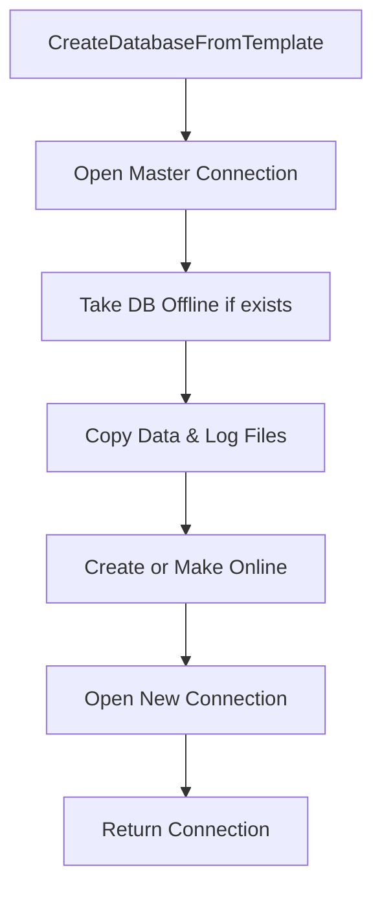

## LocalDB

How MS SqlServer LocalDB is structured

Key relationships:

 * Physical Machine → One Windows machine can have one LocalDB engine installed
 * LocalDB Engine → Can host multiple isolated instances (each is like a mini SQL Server)
 * Instance → Each contains multiple databases (always includes system DBs like master)
 * Storage → Each instance stores its .mdf and .ldf files in a subfolder under `%LOCALAPPDATA%\Microsoft\Microsoft SQL Server Local DB\Instances\`

## How this project works

### Instance Startup Flow

This flow happens once per `SqlInstance`, usually once before any tests run.

### Create DB From Template Flow

This happens once per `SqlInstance.Build`, usually once per test method.

