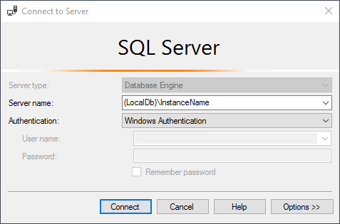
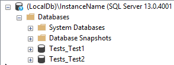

<!--
GENERATED FILE - DO NOT EDIT
This file was generated by [MarkdownSnippets](https://github.com/SimonCropp/MarkdownSnippets).
Source File: /pages/mdsource/sql-management-studio.source.md
To change this file edit the source file and then run MarkdownSnippets.
-->
# SQL Management Studio

## Connection

The SQL Server LocalDB instance server name will be `(LocalDb)\` suffixed with the instance name.

`(LocalDb)\InstanceName`

See: [SqlLocalDB Directory and Instance Name Resolution](directory-and-name-resolution.md)

## The databases

Once connected each test will have an associated test:

The Server Name and database name will be written to [Trace.WriteLine](https://docs.microsoft.com/en-us/dotnet/api/system.diagnostics.trace.writeline) during test execution. See: [Logging](logging.md)
