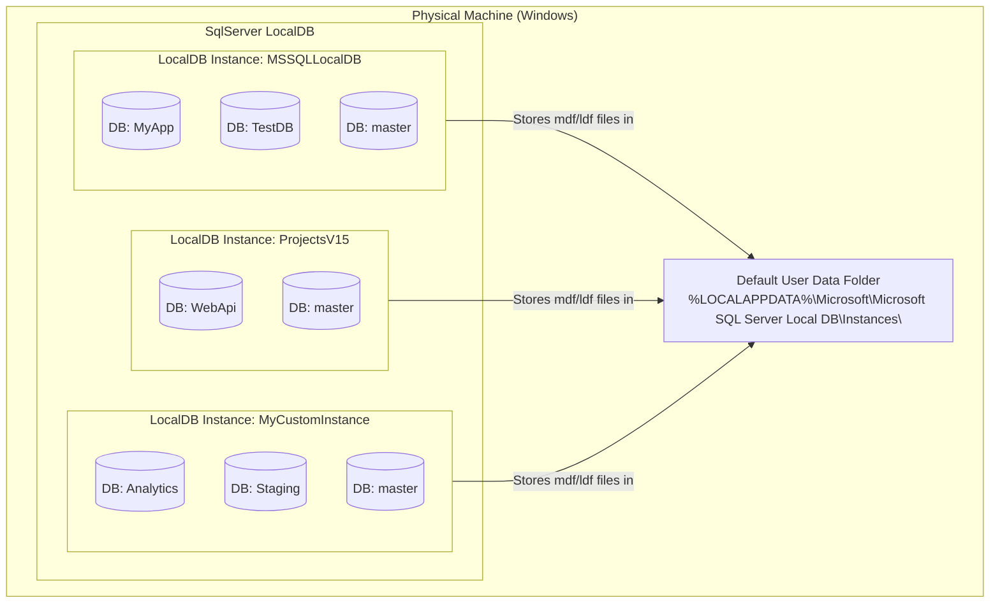
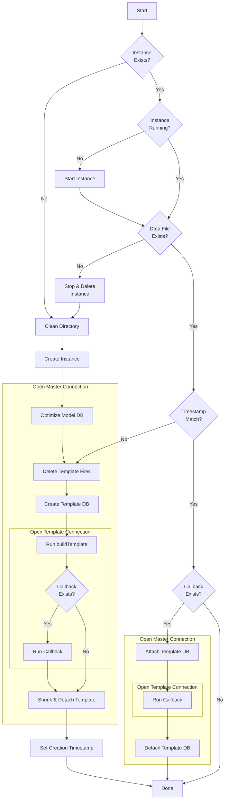
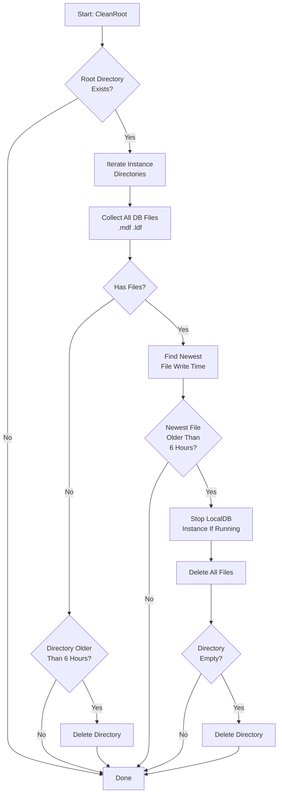
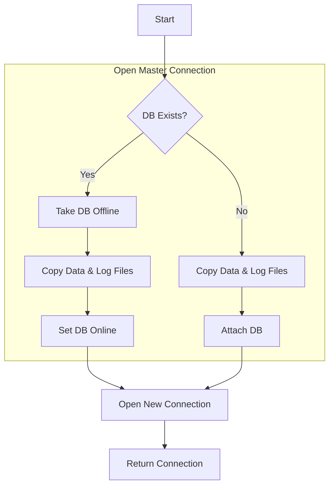

#  LocalDb

include: intro

**See [Milestones](../../milestones?state=closed) for release notes.**

**SqlLocalDB is only supported on Windows**

## Sponsors

include: zzz

toc
  * [Design](/pages/design.md)
  * [Raw Connection Usage](/pages/raw-usage.md)
  * [EntityFramework Classic Usage](/pages/ef-classic-usage.md)
  * [EntityFramework Core Usage](/pages/ef-usage.md)
  * [EntityFramework Core NUnit Usage](/pages/ef-nunit-usage.md)
  * [EntityFramework Core xunit.v3 Usage](/pages/ef-xunitv3-usage.md)
  * [EntityFramework Core MSTest Usage](/pages/ef-mstest-usage.md)
  * [EntityFramework Core TUnit Usage](/pages/ef-tunit-usage.md)
  * [EntityFramework Core Migrations](/pages/efmigrations.md)
  * [Directory and name resolution](/pages/directory-and-name-resolution.md)
  * [Sql Management Studio](/pages/sql-management-studio.md)
  * [Logging](/pages/logging.md)
  * [Template database size](/pages/template-database-size.md)
  * [Template Re-generation](/pages/template-regen.md)
  * [DB auto offline](/pages/db-auto-offline.md)
  * [Shutdown Timeout](/pages/shutdown-timeout.md)

## NuGet packages

  * https://www.nuget.org/packages/LocalDb/
  * https://www.nuget.org/packages/EfLocalDb/
  * https://www.nuget.org/packages/EfLocalDb.NUnit/
  * https://www.nuget.org/packages/EfLocalDb.Xunit.V3/
  * https://www.nuget.org/packages/EfLocalDb.MSTest/
  * https://www.nuget.org/packages/EfLocalDb.TUnit/
  * https://www.nuget.org/packages/EfClassicLocalDb/

## Why

### Goals

 * Have a isolated SQL Server Database for each unit test method.
 * Does not overly impact performance.
 * Results in a running SQL Server Database that can be accessed via [SQL Server Management Studio ](https://docs.microsoft.com/en-us/sql/ssms/sql-server-management-studio-ssms?view=sql-server-2017) (or other tooling) to diagnose issues when a test fails.

### Why not SQLite

 * SQLite and SQL Server do not have compatible feature sets and there are [incompatibilities between their query languages](https://www.mssqltips.com/sqlservertip/4777/comparing-some-differences-of-sql-server-to-sqlite/).

### Why not SQL Express or full SQL Server

 * Control over file location. SqlLocalDB connections support AttachDbFileName property, which allows developers to specify a database file location. SqlLocalDB will attach the specified database file and the connection will be made to it. This allows database files to be stored in a temporary location, and cleaned up, as required by tests.
 * No installed service is required. Processes are started and stopped automatically when needed.
 * Automatic cleanup. A few minutes after the last connection to this process is closed the process shuts down.
 * Full control of instances using the [Command-Line Management Tool: SqlLocalDB.exe](https://docs.microsoft.com/en-us/sql/relational-databases/express-localdb-instance-apis/command-line-management-tool-sqllocaldb-exe?view=sql-server-2017).

### Why not [EntityFramework InMemory](https://docs.microsoft.com/en-us/ef/core/providers/in-memory/)

 * Difficult to debug the state. When debugging a test, or looking at the resultant state, it is helpful to be able to interrogate the Database using tooling
 * InMemory is implemented with shared mutable state between instance. This results in strange behaviors when running tests in parallel, for example when [creating keys](https://github.com/aspnet/EntityFrameworkCore/issues/6872).
 * InMemory is not intended to be an alternative to SqlServer, and as such it does not support the full suite of SqlServer features. For example:
    * Does not support [Timestamp/row version](https://docs.microsoft.com/en-us/ef/core/modeling/concurrency#timestamprow-version).
    * [Does not validate constraints](https://github.com/aspnet/EntityFrameworkCore/issues/2166).

See the official guidance: [InMemory is not a relational database](https://docs.microsoft.com/en-us/ef/core/miscellaneous/testing/in-memory#inmemory-is-not-a-relational-database).

## References

 * [Which Edition of SQL Server is Best for Development Work?](https://www.red-gate.com/simple-talk/sql/sql-development/edition-sql-server-best-development-work/#8)
 * [Introducing SqlLocalDB, an improved SQL Express](https://blogs.msdn.microsoft.com/sqlexpress/2011/07/12/introducing-localdb-an-improved-sql-express/)
 * [SQL LocalDB 2022 Download](https://download.microsoft.com/download/3/8/d/38de7036-2433-4207-8eae-06e247e17b25/SqlLocalDB.msi)
 * [SQL Server 2022 Cumulative Update](https://learn.microsoft.com/en-us/troubleshoot/sql/releases/sqlserver-2022/build-versions) required to update LocalDb to the latest version.
 * [SQL Server 2022 Express via Chocolatey](https://community.chocolatey.org/packages/sql-server-express): `choco install sql-server-express`

## Usage

This project supports several approaches.

### Raw SqlConnection

Interactions with SqlLocalDB via a [SqlConnection](https://docs.microsoft.com/en-us/dotnet/api/system.data.sqlclient.sqlconnection).

[Full Usage](/pages/raw-usage.md)

### EntityFramework Classic

Interactions with SqlLocalDB via [Entity Framework Classic](https://docs.microsoft.com/en-us/ef/ef6/).

[Full Usage](/pages/ef--classic-usage.md)

### EntityFramework Core

Interactions with SqlLocalDB via [Entity Framework Core](https://docs.microsoft.com/en-us/ef/core/).

[Full Usage](/pages/ef-usage.md)

### EntityFramework Core NUnit

NUnit test base class wrapping EfLocalDb with Arrange-Act-Assert phase enforcement.

[Full Usage](/pages/ef-nunit-usage.md)

### EntityFramework Core xunit.v3

xunit.v3 test base class wrapping EfLocalDb with Arrange-Act-Assert phase enforcement.

[Full Usage](/pages/ef-xunitv3-usage.md)

### EntityFramework Core MSTest

MSTest test base class wrapping EfLocalDb with Arrange-Act-Assert phase enforcement.

[Full Usage](/pages/ef-mstest-usage.md)

### EntityFramework Core TUnit

TUnit test base class wrapping EfLocalDb with Arrange-Act-Assert phase enforcement.

[Full Usage](/pages/ef-tunit-usage.md)

## LocalDB

How MS SqlServer LocalDB is structured

Key relationships:

 * Physical Machine → One Windows machine can have one LocalDB engine installed
 * LocalDB Engine → Can host multiple isolated instances (each is like a mini SQL Server)
 * Instance → Each contains multiple databases (always includes system DBs like master)
 * Storage → Each instance stores its .mdf and .ldf files in a subfolder under `%LOCALAPPDATA%\Microsoft\Microsoft SQL Server Local DB\Instances\`

## How this project works

### Inputs

#### buildTemplate

A delegate that builds the template database schema. Called zero or once based on the current state of the underlying LocalDB:

 * **Not called** if a valid template already exists (timestamp matches)
 * **Called once** if the template needs to be created or rebuilt

The delegate receives a connected DbContext (EF) or SqlConnection (raw) to create schema and seed initial data.

#### timestamp

A timestamp used to determine if the template database needs to be rebuilt:

 * If the timestamp is **newer** than the existing template, the template is recreated
 * Defaults to the last modified time of `buildTemplate` delegate's assembly, or the `TDbContext` assembly if `buildTemplate` is null

#### callback

A delegate executed after the template database has been created or mounted:

 * **Guaranteed to be called exactly once** per `SqlInstance` at startup
 * Receives a SqlConnection and DbContext (EF) for seeding reference data or post-creation setup
 * Called regardless of whether `buildTemplate` ran (useful for setup that must always occur)

### SqlInstance Startup Flow

This flow happens once per `SqlInstance`, usually once before any tests run.

### Clean Directory Flow

On first access, the library scans the data root directory (`%TEMP%\LocalDb` by default) and cleans up stale database files. This prevents unbounded disk growth from old test runs.

Key behaviors:

 * **Triggered once** during `DirectoryFinder` static initialization, before any `SqlInstance` starts.
 * **All-or-nothing cleanup**: The newest file write time in a directory determines whether the entire instance is stale. If any file is recent, nothing is touched. This avoids partially cleaning an active instance.
 * **6-hour cutoff**: An instance directory is only cleaned if all its files have a last-write time older than 6 hours.
 * **Stops running instances**: If stale files belong to a running LocalDB instance, the instance is stopped (via `KillProcess`) before deletion. This prevents `UnauthorizedAccessException` from locked `.mdf`/`.ldf` files.
 * **Empty directory cleanup**: Empty directories older than 6 hours are removed.
 * The instance name is derived from the directory name (e.g. `%TEMP%\LocalDb\MyTestInstance` → instance name `MyTestInstance`).

### Create SqlDatabase Flow

This happens once per `SqlInstance.Build`, usually once per test method.

## Performance

Benchmarks measuring SqlInstance startup performance under different LocalDB states.
Results collected using [BenchmarkDotNet](https://benchmarkdotnet.org/).

### Hardware

 * BenchmarkDotNet v0.15.8, Windows 11 (10.0.26200.7623)
 * AMD Ryzen 9 5900X 3.70GHz, 1 CPU, 24 logical and 12 physical cores
 * .NET SDK 10.0.102

### Scenarios

| Scenario    | Description | When It Occurs |
|-------------|-------------|----------------|
| **Cold**    | LocalDB instance does not exist. Full startup from scratch. | First run on a machine, or after `sqllocaldb delete`. Rare in practice. |
| **Stopped** | LocalDB instance exists but is stopped. Instance is started and existing template files are reused. | After LocalDB auto-shutdown (default: 5 min idle) or system restart. Performance similar to Warm/Rebuild. [More info](/pages/shutdown-timeout.md) |
| **Rebuild** | LocalDB running, but template timestamp changed. | After code changes that modify the `buildTemplate` delegate's assembly. Common during development. [More info](/pages/template-regen.md) |
| **Warm**    | LocalDB running with valid template. | Typical test runs when instance is already warm. **Most common scenario.** |

### Results

All times in milliseconds.

| DBs | Cold total | Cold per DB | Stopped total | Stopped per DB | Rebuild total | Rebuild per DB | Warm total | Warm per DB |
|----:|-----:|--------:|--------:|-----------:|--------:|-----------:|-----:|--------:|
| 0 | 6396 | - | 472 | - | 85 | - | 3 | - |
| 1 | 6395 | 6395 | 514 | 514 | 120 | 120 | 40 | 40 |
| 5 | 6542 | 1308 | 641 | 128 | 267 | 53 | 173 | 35 |
| 10 | 6705 | 671 | 834 | 83 | 421 | 42 | 402 | 40 |
| 100 | 10284 | 103 | 3900 | 39 | 3436 | 34 | 3328 | 33 |

### Key Insights

 * **Stopped ≈ Warm/Rebuild**: When a stopped instance is detected, the library starts it and reuses the existing template files. This provides ~500ms performance instead of Cold (~6.4s). [More info](/pages/shutdown-timeout.md)
 * **Warm is 2000x faster than Cold**: With 0 databases, warm start takes ~3ms vs ~6.4s for cold start. This is the primary optimization the library provides.
 * **Rebuild is 75x faster than Cold**: When only the template needs rebuilding (code changed), startup is ~85ms vs ~6.4s.
 * **Marginal cost per database converges to ~35ms**: Regardless of startup scenario, each additional database adds approximately 35ms once the instance is running.
 * **At scale, database creation dominates**: With 100 databases, Warm/Rebuild/Stopped scenarios converge to similar total times (~3.3-3.9s) because database creation time dominates. Cold remains slower (~10s).
 * **Tests re-run after system restart** will now benefit from stopped instance reconstitution, avoiding cold start times. [More info](/pages/shutdown-timeout.md)
 * **Minimize databases per test** when possible, as each database adds ~35ms overhead

## Debugging

To connect to a SqlLocalDB instance using [SQL Server Management Studio ](https://docs.microsoft.com/en-us/sql/ssms/sql-server-management-studio-ssms?view=sql-server-2017) use a server name with the following convention `(LocalDb)\INSTANCENAME`.

So for a instance named `MyDb` the server name would be `(LocalDb)\MyDb`. Note that the name will be different if a `name` or `instanceSuffix` have been defined for SqlInstance.

The server name will be written to [Trace.WriteLine](https://docs.microsoft.com/en-us/dotnet/api/system.diagnostics.trace.writeline) when a SqlInstance is constructed. It can be accessed programmatically from `SqlInstance.ServerName`. See [Logging](/pages/logging.md).

## SqlLocalDb

The [SqlLocalDb Utility (SqlLocalDB.exe)](https://docs.microsoft.com/en-us/sql/tools/sqllocaldb-utility) is a command line tool to enable users and developers to create and manage an instance of SqlLocalDB.

Useful commands:

 * `sqllocaldb info`: list all instances
 * `sqllocaldb create InstanceName`: create a new instance
 * `sqllocaldb start InstanceName`: start an instance
 * `sqllocaldb stop InstanceName`: stop an instance
 * `sqllocaldb delete InstanceName`: delete an instance (this does not delete the file system data for the instance)

## ReSharper Test Runner

The ReSharper Test Runner has a feature that detects spawned processes, and prompts if they do not shut down when a test ends. This is problematic when using SqlLocalDB since the Sql Server process continues to run:

To avoid this error spawned processes can be ignored:

## Credits

SqlLocalDB API code sourced from https://github.com/skyguy94/Simple.LocalDb

## Icon

[Robot](https://thenounproject.com/term/robot/960055/) designed by [Creaticca Creative Agency](https://thenounproject.com/creaticca/) from [The Noun Project](https://thenounproject.com/).